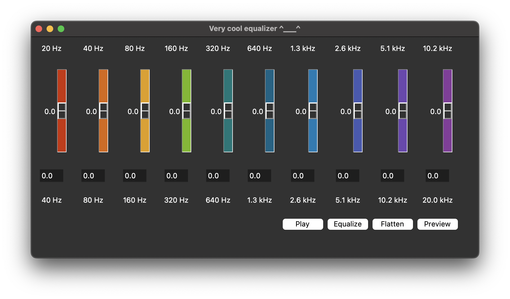

# Audio equalizer
## Overview
This project implements an equalizer of audio signal on the human-perceivable spectrum of 20-20000 Hz with the use of [Fast Fourier Transform (FFT)](https://en.wikipedia.org/wiki/Fast_Fourier_transform), with the algorithm written in C++ and signal parsing/plotting written in Python.
## Requirements
This project uses C++20 and Python 3, and as such will require:
* gcc compiler supporting "-std=c++2a" parameter (C++20 standard).
* python3 compiler
* bash shell (default location: "/bin/bash")
## Usage
Navigate to `python_utils` and execute:

```python equalizerGUI.py```

## Note
This project was written as a part of a thesis for Bachelor's Degree in Computational Mathematics at Jagiellonian University in Kraków.

## Acknowledgements
* Icon for the equalizer app was downloaded from: https://icons8.com/icons/set/equalizer
